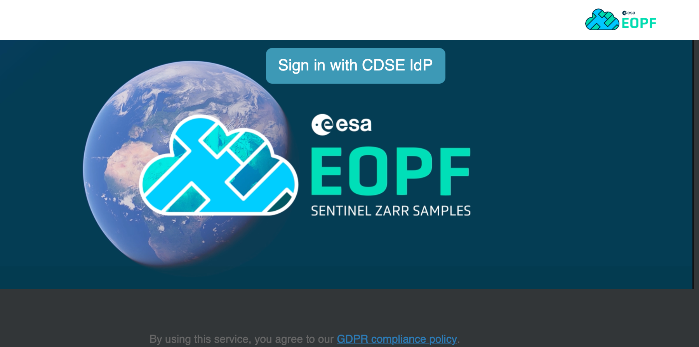
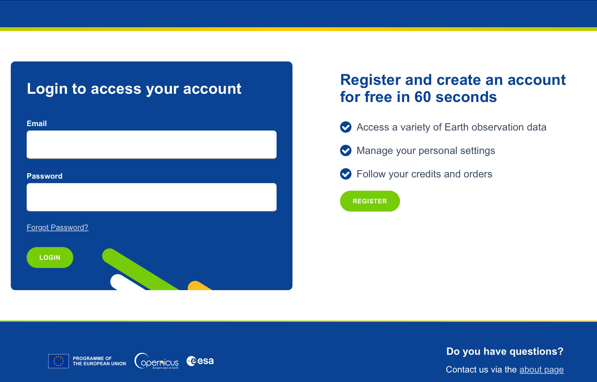
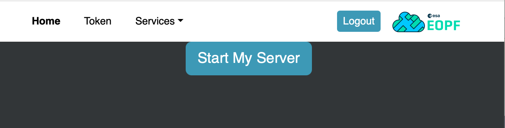
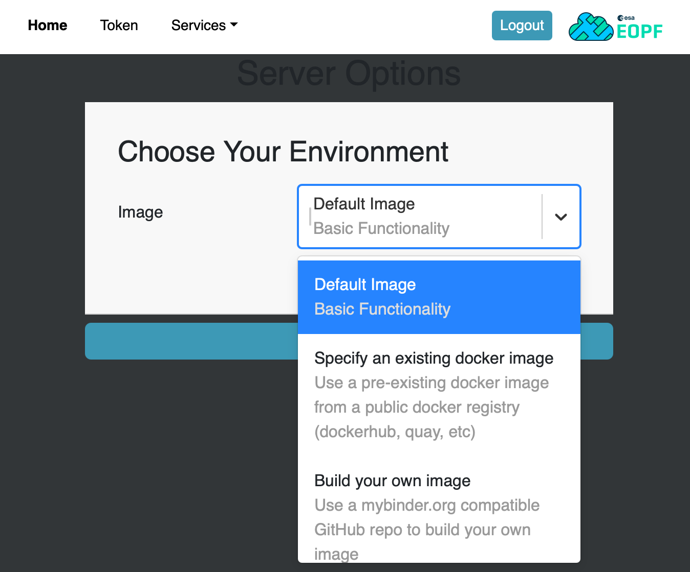
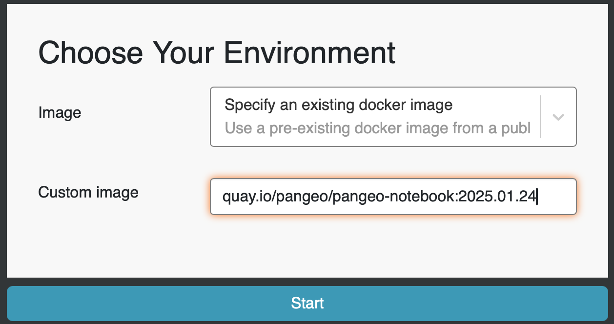
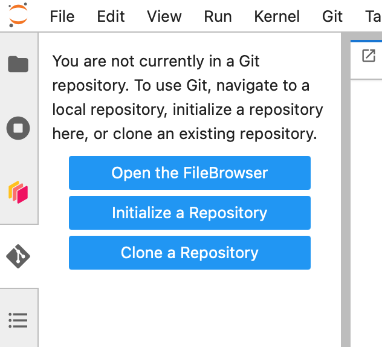
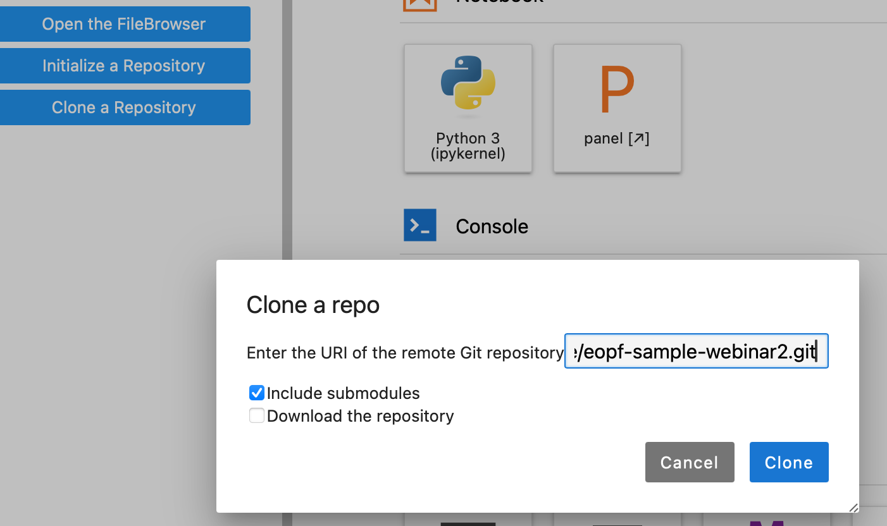
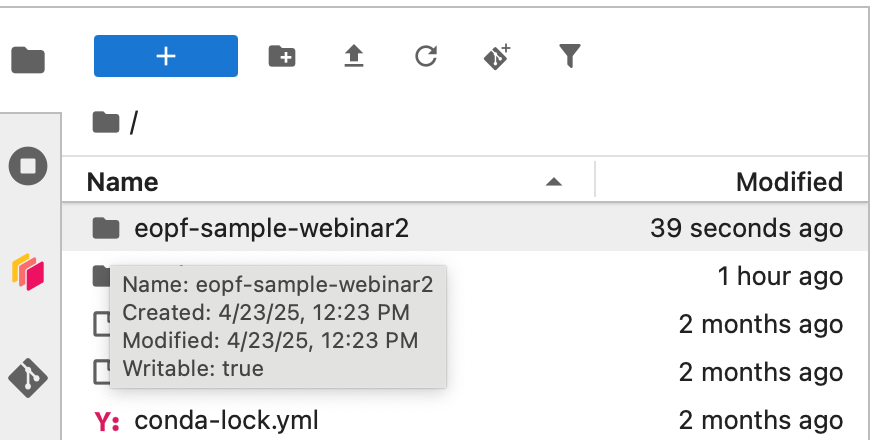
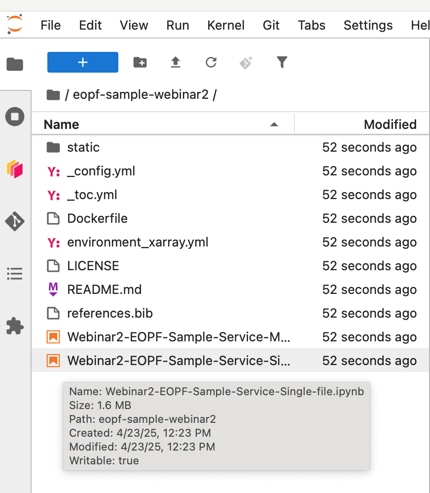
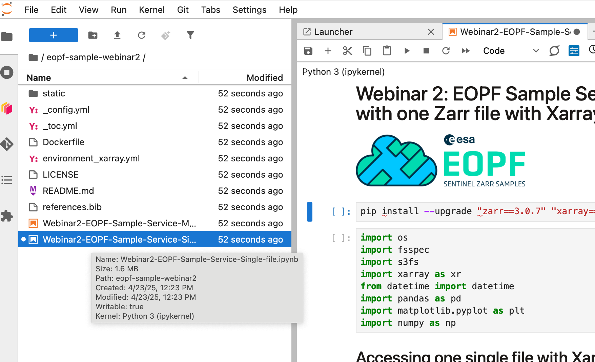

# Welcome to EOPF Webinar 2!

Welcome to the hands-on materials for the **second EOPF Sample Service Webinar**.

## Accessing the Webinar Environment

This webinar runs on the **EOPF Sample Service JupyterHub** environment.

👉 Connect via: [https://jupyterhub.user.eopf.eodc.eu/hub](https://jupyterhub.user.eopf.eodc.eu/hub)



Click **Sign in with CDSE IdP** to proceed.

You will be redirected to the CDSE login page:



Please log in using your **CDSE user account**.  
If you do not have one, refer to the **first webinar instructions** on how to create an account for CDSE services.

Once logged in, you will see the following interface:



Click **Start My Server** to launch your Jupyter session.

---

## Starting Your Environment

After starting your server, you will be directed to the JupyterHub Launcher.



Follow these steps:

1. In the launcher interface, locate the field for selecting a custom Docker image.
2. Enter the following image:


   ```
   quay.io/pangeo/pangeo-notebook:2025.01.24
   ```



This will start a JupyterLab environment based on the Pangeo notebook image.

---

## Cloning the Webinar Repository

Once your environment is running, click on the **Git icon** in the left sidebar.



Choose **Clone a Repository**, then paste the following URL to clone the webinar materials into your workspace:


```
https://github.com/EOPF-Sample-Service/eopf-sample-webinar2.git
```


---

## Launching the Notebooks

Navigate to the following directory:
```
/eopf-sample-webinar2/
```


Open one of the notebooks to begin. For example:
- `Webinar2-EOPF-Sample-Service-Single-file.ipynb`



---

## 🎉 You're Ready!

You are now ready to begin the hands-on session of the EOPF Sample Service Webinar. Enjoy!


